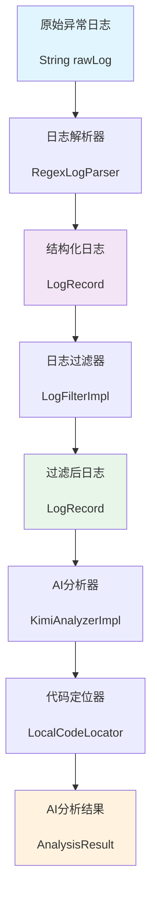
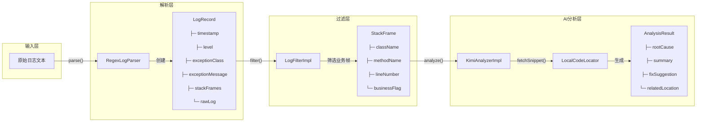
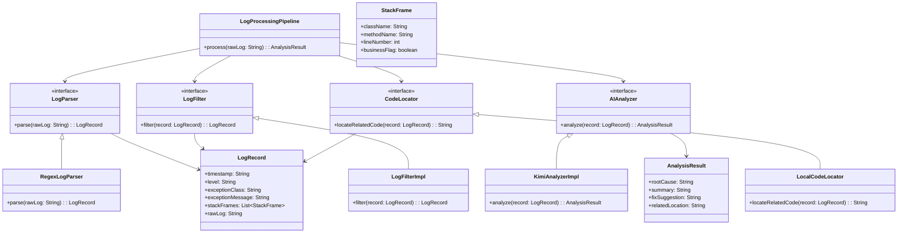

## 🚀 项目概述

AI日志分析代理是一个基于Spring Boot的智能异常诊断系统，能够自动解析Java异常日志，通过AI模型分析根因，并提供专业的修复建议。

### ✨ 核心功能
- **智能日志解析**：自动解析异常日志，提取关键信息
- **业务代码聚焦**：过滤框架堆栈，专注业务相关代码
- **AI智能分析**：调用Kimi AI模型进行异常根因分析
- **代码片段展示**：自动获取相关源码，提供上下文信息
- **专业修复建议**：生成结构化的诊断报告和解决方案

## 📊 数据流转与类转化流程

### 🔄 核心数据流



### 🏗️ 类结构转化流程



## 🏗️ 架构设计

### 1. **日志解析层**

* **LogParser**

    * 职责：把原始 `String` 日志 → 拆解成结构化字段
    * 方法：`parse(String rawLog): LogRecord`

* **LogFilter**

    * 职责：对解析后的结果做清理、聚合、去噪
    * 方法：`filter(LogRecord record): LogRecord`

### 2. **数据模型层**

* **LogRecord**（日志记录，结构化对象）

    * 时间戳（timestamp）
    * 日志级别（level）
    * 异常类名（exceptionClass）
    * 异常消息（exceptionMessage）
    * 堆栈列表（List<StackFrame>）
    * 原始日志（rawLog，保留原始字符串）

* **StackFrame**（堆栈帧）

    * 类名（className）
    * 方法名（methodName）
    * 行号（lineNumber）
    * 是否业务相关（boolean businessFlag，用于过滤）

### 3. **AI 分析层**

* **AIAnalyzer**

    * 职责：接收 `LogRecord`，调用 AI 模型，输出诊断
    * 方法：`analyze(LogRecord record): AnalysisResult`

* **AnalysisResult**（AI 结果对象）

    * 根因推测（rootCause）
    * 错误摘要（summary）
    * 修复建议（fixSuggestion）
    * 关联类方法（可能的代码位置）

### 4. **协调层**

* **LogProcessingPipeline**

    * 职责：把这些组件串起来（Parser → Filter → AI）
    * 方法：`process(String rawLog): AnalysisResult`

---

---

## 🚀 快速开始

### 📋 环境要求
- Java 21+
- Maven 3.6+
- Spring Boot 3.5.6+

### 🔧 配置说明

#### ⚠️ 重要安全提醒
本项目包含敏感的API密钥配置，**请勿将真实配置文件提交到Git仓库**！

#### 1️⃣ 快速配置（推荐）
使用提供的设置脚本：
```bash
# 运行设置脚本
./setup.sh
```

#### 2️⃣ 手动配置
1. **复制配置文件模板：**
```bash
cp src/main/resources/application-template.yml src/main/resources/application.yml
```

2. **编辑配置文件：**
在 `application.yml` 中配置Kimi API：
```yaml
ai:
  kimi:
    api-key: "your-kimi-api-key"  # 替换为你的Kimi API密钥
    base-url: "https://api.moonshot.cn/v1"
    model: "moonshot-v1-8k"
    max-tokens: 2000
    temperature: 0.3
```

3. **详细配置指南：**
查看 [CONFIG_SETUP.md](CONFIG_SETUP.md) 获取完整的配置说明和安全最佳实践。

#### 3️⃣ 业务包配置
在 `LogFilterImpl.java` 中配置业务包前缀：
```java
private static final String[] BUSINESS_PACKAGES = {
    "com.dyyl", "com.wkb"  // 添加你的业务包前缀
};
```

### 🎯 使用示例

```java
@Autowired
private LogProcessingPipeline pipeline;

// 分析异常日志
String rawLog = """
    异常时间: 2024-01-20 10:30:45
    异常级别: ERROR
    异常描述: java.lang.NullPointerException: userService is null
    详细信息: [com.example.controller.UserController.getUser(UserController.java:45), ...]
    """;

AnalysisResult result = pipeline.process(rawLog);
System.out.println("根因: " + result.getRootCause());
System.out.println("摘要: " + result.getSummary());
System.out.println("修复建议: " + result.getFixSuggestion());
```

---

## 📊 处理流程详解

### 1️⃣ **日志解析阶段**
- **输入**: 原始异常日志文本
- **处理**: 使用正则表达式提取时间戳、异常级别、异常描述、堆栈信息
- **输出**: 结构化的 `LogRecord` 对象

### 2️⃣ **业务过滤阶段**
- **输入**: `LogRecord` 包含所有堆栈帧
- **处理**: 根据业务包前缀过滤，只保留业务相关代码
- **输出**: 过滤后的 `LogRecord`（业务帧优先，无业务帧则保留第一个）

### 3️⃣ **AI分析阶段**
- **输入**: 过滤后的 `LogRecord`
- **处理**:
  - 构建包含异常信息和代码上下文的AI提示词
  - 调用Kimi AI模型进行分析
  - 提取结构化的分析结果
- **输出**: `AnalysisResult` 包含根因、摘要、修复建议等

### 4️⃣ **代码定位阶段**
- **输入**: 堆栈帧信息
- **处理**: 读取本地源码文件，获取异常行的上下文代码
- **输出**: 代码片段列表，用于AI分析和展示

---

## 🎨 预期输出示例

### 输入日志
```
异常时间: 2024-01-20 10:30:45
异常级别: ERROR
异常描述: java.lang.NullPointerException: Cannot invoke "com.example.service.UserService.findById(Long)" because "this.userService" is null
详细信息: [com.example.controller.UserController.getUser(UserController.java:45), com.example.controller.UserController$$FastClassBySpringCGLIB$$7b3e4c7c.invoke(<generated>), ...]
```

### AI分析结果
```json
{
  "rootCause": "userService对象为null，导致无法调用findById方法",
  "summary": "UserController第45行发生空指针异常",
  "fixSuggestion": "检查userService的依赖注入配置，确保在UserController类上添加@Service注解，在userService字段上添加@Autowired注解",
  "relatedLocation": "com.example.controller.UserController.getUser:45"
}
```

---

## 🔧 技术栈

- **框架**: Spring Boot 3.5.6
- **语言**: Java 21
- **构建工具**: Maven
- **AI模型**: Kimi (Moonshot)
- **数据格式**: JSON
- **设计模式**: 领域驱动设计(DDD)

---

## 📝 开发状态

- ✅ **数据模型层** - 完整实现
- ✅ **日志解析层** - 完整实现
- ✅ **日志过滤层** - 完整实现
- ✅ **AI分析层** - 完整实现
- ⚠️ **协调层** - 待实现流程编排
- ⚠️ **基础设施层** - 待完善配置管理
- ⚠️ **测试覆盖** - 待补充单元测试

---

## 🤝 贡献指南

1. Fork 项目到个人仓库
2. 创建特性分支 (`git checkout -b feature/amazing-feature`)
3. 提交更改 (`git commit -m 'Add amazing feature'`)
4. 推送到分支 (`git push origin feature/amazing-feature`)
5. 创建 Pull Request

---

## 📄 许可证

本项目采用 MIT 许可证 - 查看 [LICENSE](LICENSE) 文件了解详情

---

## 🆘 常见问题

**Q: 如何处理AI服务不可用的情况？**
A: 系统内置了降级机制，当AI服务不可用时，会返回基于异常类型的默认分析结果。

**Q: 支持哪些类型的异常日志？**
A: 目前针对中文格式的异常日志进行了优化，支持常见的Java异常类型。

**Q: 如何配置更多的业务包？**
A: 在`LogFilterImpl.java`中修改`BUSINESS_PACKAGES`数组即可。

---

## 🌰 类图草案（mermaid）



* **新增类**：`LogParser`、`LogFilter`、`AIAnalyzer`、`LogProcessingPipeline`
* **新增数据结构**：`LogRecord`、`StackFrame`、`AnalysisResult`

---

## 📁 目录结构

```
src/main/java/com/lllkkk/ai/agent/modules/log/handle/
├── application/                    # 应用服务，组合调用
│   └── LogProcessingPipeline.java
├── domain/                         # 领域层
│   ├── model/
│   │   ├── LogRecord.java         # 日志记录模型
│   │   ├── StackFrame.java        # 堆栈帧模型
│   │   └── AnalysisResult.java    # AI分析结果模型
│   └── service/
│       ├── LogParser.java         # 日志解析接口
│       ├── LogFilter.java         # 日志过滤接口
│       ├── AIAnalyzer.java        # AI分析接口
│       ├── CodeLocator.java       # 代码定位接口
│       └── impl/                  # 接口实现
│           ├── RegexLogParser.java     # 正则表达式日志解析器
│           ├── LogFilterImpl.java      # 日志过滤器实现
│           ├── KimiAnalyzerImpl.java   # Kimi AI分析器实现
│           └── LocalCodeLocator.java   # 本地代码定位器
└── infrastructure/                 # 基础设施层
    # AI接口调用、配置等相关代码
```
