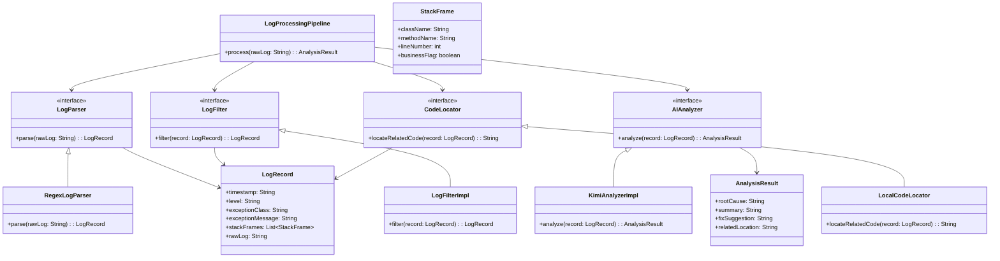

##  模块划分

### 1. **日志解析层**

* **LogParser**

    * 职责：把原始 `String` 日志 → 拆解成结构化字段
    * 方法：`parse(String rawLog): LogRecord`

* **LogFilter**

    * 职责：对解析后的结果做清理、聚合、去噪
    * 方法：`filter(LogRecord record): LogRecord`

---

### 2. **数据模型层**

* **LogRecord**（日志记录，结构化对象）

    * 时间戳（timestamp）
    * 日志级别（level）
    * 异常类名（exceptionClass）
    * 异常消息（exceptionMessage）
    * 堆栈列表（List<StackFrame>）
    * 原始日志（rawLog，保留原始字符串）

* **StackFrame**（堆栈帧）

    * 类名（className）
    * 方法名（methodName）
    * 行号（lineNumber）
    * 是否业务相关（boolean businessFlag，用于过滤）

---

### 3. **AI 分析层**

* **AIAnalyzer**

    * 职责：接收 `LogRecord`，调用 AI 模型，输出诊断
    * 方法：`analyze(LogRecord record): AnalysisResult`

* **AnalysisResult**（AI 结果对象）

    * 根因推测（rootCause）
    * 错误摘要（summary）
    * 修复建议（fixSuggestion）
    * 关联类方法（可能的代码位置）

---

### 4. **协调层**

* **LogProcessingPipeline**

    * 职责：把这些组件串起来（Parser → Filter → AI）
    * 方法：`process(String rawLog): AnalysisResult`

---

## 🌰 类图草案（mermaid）



* **新增类**：`LogParser`、`LogFilter`、`AIAnalyzer`、`LogProcessingPipeline`
* **新增数据结构**：`LogRecord`、`StackFrame`、`AnalysisResult`

---

## 📁 目录结构

```
src/main/java/com/lllkkk/ai/agent/modules/log/handle/
├── application/                    # 应用服务，组合调用
│   └── LogProcessingPipeline.java
├── domain/                         # 领域层
│   ├── model/
│   │   ├── LogRecord.java         # 日志记录模型
│   │   ├── StackFrame.java        # 堆栈帧模型
│   │   └── AnalysisResult.java    # AI分析结果模型
│   └── service/
│       ├── LogParser.java         # 日志解析接口
│       ├── LogFilter.java         # 日志过滤接口
│       ├── AIAnalyzer.java        # AI分析接口
│       ├── CodeLocator.java       # 代码定位接口
│       └── impl/                  # 接口实现
│           ├── RegexLogParser.java     # 正则表达式日志解析器
│           ├── LogFilterImpl.java      # 日志过滤器实现
│           ├── KimiAnalyzerImpl.java   # Kimi AI分析器实现
│           └── LocalCodeLocator.java   # 本地代码定位器
└── infrastructure/                 # 基础设施层
    # AI接口调用、配置等相关代码
```
